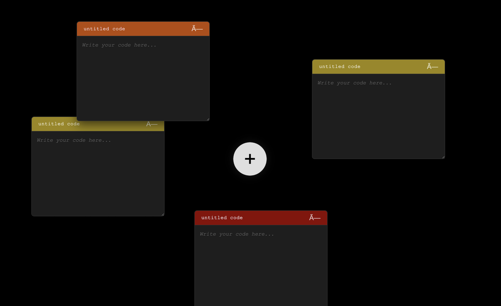

# Code Canvas

A Chrome extension that turns your new tab into a floating code workspace.

## Features
- Benzene landing page → click + to enter
- Black canvas, unlimited floating code tabs
- Red/yellow/orange colored roofs
- Double-click title to rename
- Drag anywhere, auto-save

## Install
1. Download this folder
2. Go to `chrome://extensions/`
3. Enable Developer mode
4. Click "Load unpacked"
5. Select folder

## Files
- `manifest.json` - Extension config
- `benzene.html` - Landing page
- `styles.css` - All styling
- `canvas.js` - All logic

## License
MIT
